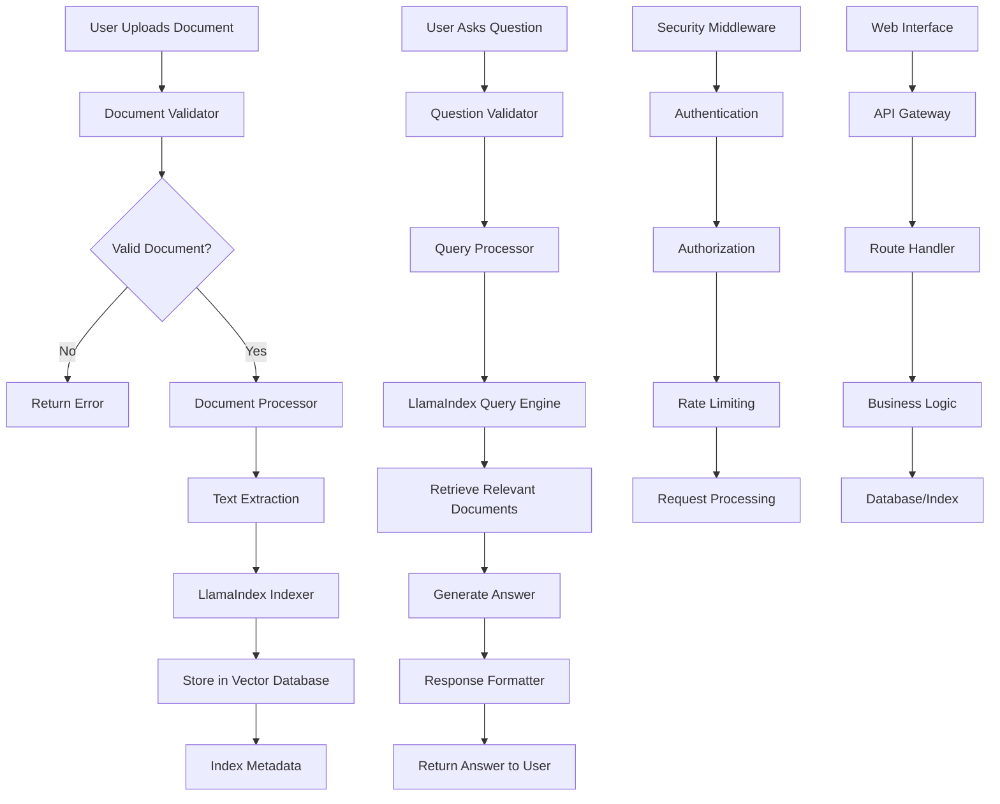

# Private Document Q&A System

A secure, intelligent document Q&A system built with LlamaIndex that allows you to index internal documents and interact with them through a conversational chatbot interface.

## 🚀 Features

- **Document Indexing**: Automatically index various document formats (PDF, DOCX, TXT, etc.)
- **Intelligent Q&A**: Ask questions about your documents and get accurate answers
- **Security**: Document-level access control and secure storage
- **Modular Architecture**: Clean, maintainable code structure
- **Web Interface**: User-friendly chat interface
- **API Support**: RESTful API for integration with other systems

## 📋 Prerequisites

- Python 3.8+
- pip package manager

## 🛠️ Installation

1. Clone the repository:
```bash
git clone <repository-url>
cd Private-Document-Q-A
```

2. Install dependencies:
```bash
pip install -r requirements.txt
```

3. Set up environment variables:
```bash
cp .env.example .env
# Edit .env with your configuration
```

## 🏃‍♂️ Quick Start

1. **Start the application**:
```bash
python app.py
```

2. **Upload documents**:
   - Place documents in the `documents/` folder
   - Or use the web interface to upload files

3. **Ask questions**:
   - Use the web interface at `http://localhost:5000`
   - Or use the API endpoints

## 📁 Project Structure

```
Private-Document-Q-A/
├── app.py                 # Main application entry point
├── config/
│   ├── __init__.py
│   └── settings.py        # Configuration settings
├── core/
│   ├── __init__.py
│   ├── document_indexer.py # Document indexing logic
│   ├── qa_engine.py       # Q&A processing engine
│   └── security.py        # Security and access control
├── api/
│   ├── __init__.py
│   ├── routes.py          # API endpoints
│   └── middleware.py      # API middleware
├── web/
│   ├── __init__.py
│   ├── templates/         # HTML templates
│   ├── static/           # CSS, JS, images
│   └── routes.py         # Web routes
├── utils/
│   ├── __init__.py
│   ├── file_handlers.py  # File processing utilities
│   └── validators.py     # Input validation
├── documents/            # Document storage
├── index/               # LlamaIndex storage
├── tests/               # Test files
├── requirements.txt      # Python dependencies
├── .env.example         # Environment variables template
└── README.md           # This file
```

## 🔄 System Flowchart



## 🔧 Configuration

Edit `config/settings.py` to customize:

- **Model Settings**: Choose different LLM models
- **Index Settings**: Configure vector database parameters
- **Security Settings**: Set up authentication and authorization
- **API Settings**: Configure rate limits and endpoints

## 🔒 Security Features

- **Document Access Control**: Role-based document access
- **Input Validation**: Sanitize all user inputs
- **Rate Limiting**: Prevent abuse of the API
- **Secure Storage**: Encrypted document storage
- **Audit Logging**: Track all document access and queries

## 📚 API Documentation

### Upload Document
```http
POST /api/documents/upload
Content-Type: multipart/form-data

file: <document_file>
```

### Ask Question
```http
POST /api/qa/ask
Content-Type: application/json

{
  "question": "What is the main topic of the document?",
  "document_id": "optional_document_id"
}
```

### Get Documents
```http
GET /api/documents
Authorization: Bearer <token>
```

## 🧪 Testing

Run tests with:
```bash
python -m pytest tests/
```

## 🤝 Contributing

1. Fork the repository
2. Create a feature branch
3. Make your changes
4. Add tests for new functionality
5. Submit a pull request

## 📄 License

This project is licensed under the MIT License - see the LICENSE file for details.

## 🆘 Support

For support and questions:
- Create an issue in the repository
- Check the documentation in the `docs/` folder
- Review the example configurations

## 🔄 Updates

- **v1.0.0**: Initial release with basic Q&A functionality
- **v1.1.0**: Added web interface and API endpoints
- **v1.2.0**: Enhanced security features and document management
